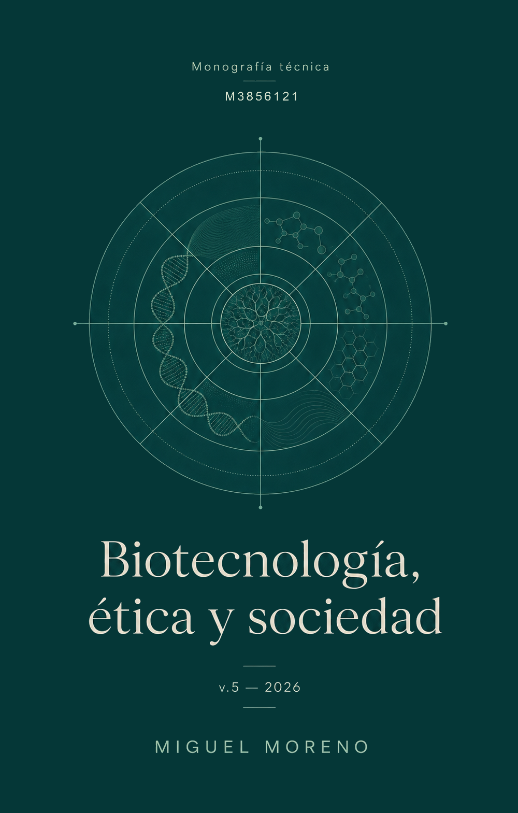

# Biotecnología, ética y sociedad

### Monografía técnica M3856121 · v.5 – 2026  
[](https://doi.org/10.5281/zenodo.10200371)
[](http://creativecommons.org/licenses/by-nc-sa/4.0/)

**Miguel Moreno Muñoz · Universidad de Granada**  
[](https://orcid.org/0000-0002-0746-9587)

Material docente para el Máster Universitario en Biotecnología de la Universidad de Granada. Proporciona los elementos conceptuales necesarios para adquirir una perspectiva informada y crítica sobre las biotecnologías y sus aplicaciones, con especial atención a la distorsión de la opinión pública que producen ciertos patrones de comunicación de la ciencia.

## Portada

<details>
  <summary>Ver portada</summary>
  <br>

  
</details>

## Disponibilidad

El sitio se despliega desde este repositorio en varios servicios espejo. Todos sirven el mismo contenido; si uno falla, cualquiera de los demás funciona.

| | |
|:--|:--|
| **GitHub Pages** | <https://utilizas.github.io/bes2026/> |
| **Vercel** | <https://bes2026.vercel.app/> |
| **Netlify** | <https://bes2026.netlify.app/> |
| **Cloudflare** | <https://bes2026.utilizas.workers.dev> |
| **Zenodo** | <https://doi.org/10.5281/zenodo.10200371> · fichero HTML autónomo, para archivo y consulta sin conexión |

La redundancia no es un capricho: se trata de material que debe estar accesible en fechas concretas del calendario docente, y ningún proveedor gratuito garantiza disponibilidad ni permanencia de condiciones.

## Qué contiene

| | |
|--:|:--|
| **10** | apartados, con subapartados estables y referencias cruzadas |
| **65.000** | palabras |
| **563** | referencias en `referencias.bib`, fuente única |
| **133** | términos de glosario con texto emergente accesible |
| **27** | estudios de caso con documentación, preguntas y dinámicas de trabajo |
| **16** | tablas con rótulo y referencia cruzada |

Los apartados recorren la bioética como dominio interdisciplinar, los estudios CTS, las ciencias genómicas, las terapias génicas, el debate sobre la eugenesia liberal, el uso experimental de embriones humanos, la biotecnología vegetal, el medio ambiente, la economía del sector y el acceso en países en desarrollo.

## Cómo citar

> Moreno Muñoz, M. (2026). *Biotecnología, ética y sociedad*. Monografía técnica M3856121, v.5 – 2026. Zenodo. <https://doi.org/10.5281/zenodo.10200371>

El DOI es de concepto: resuelve siempre a la versión más reciente, y las anteriores siguen accesibles desde el propio registro.

## Licencia

El texto se publica bajo [CC BY-NC-SA 4.0](http://creativecommons.org/licenses/by-nc-sa/4.0/). Puede copiarse, distribuirse y adaptarse citando la autoría, sin uso comercial y manteniendo la misma licencia en las obras derivadas. El uso docente en aula, la traducción y la reutilización de fragmentos con cita no requieren permiso adicional.

**Las figuras procedentes de artículos de terceros no se reproducen**: se enlazan a su fuente original, con su pie y su DOI, y conservan la licencia que les corresponda.

---

# Documentación técnica

## Dos salidas, los mismos ficheros

La monografía se publica de dos formas, generadas del mismo original mediante **perfiles de Quarto**:

| | perfil `libro` | perfil `unico` |
|:---|:---|:---|
| Qué es | Sitio multipágina | Un solo `.html` autónomo |
| Buscador | Nativo, sobre todo el texto | Por página, propio |
| Recursos | Externos | Incrustados en base64 |
| Sin conexión | No | Sí |
| Para qué | Uso diario, clase, web | Depósito en Zenodo bajo el DOI |
| Salida | `_salida/libro/` | `_salida/bes26.html` |

## Requisitos

- **Quarto ≥ 1.4** — <https://quarto.org/docs/get-started/>
- **R con `knitr`** — el apartado 8 lleva dos chunks que generan sus figuras. Usan **solo R base**, sin paquetes adicionales.

## Cómo está organizado

```
_quarto.yml            configuración COMPARTIDA: bibliografía, filtros, glosario
_quarto-libro.yml      perfil «libro»: capítulos, barra lateral, buscador
_quarto-unico.yml      perfil «unico»: embed-resources, renderiza solo bes26.qmd

index.qmd              presentación, introducción, agradecimientos
01…10-*.qmd            los diez apartados
11-glosario.qmd        marcador; el contenido lo genera el filtro
12-bibliografia.qmd    marcador; el contenido lo genera citeproc
13-indices.qmd         generado por scripts/indices.py: casos y tablas
bes26.qmd              raíz del perfil «unico»: reúne todo con 

referencias.bib        FUENTE ÚNICA DE VERDAD de la bibliografía
glosario.yml           FUENTE ÚNICA DE VERDAD del glosario
apa-es.csl             estilo de cita
estilos.scss           tema: colores, tipografía, bloques, impresión
filters/*.lua          glosario cruzado, estudios de caso, refs por apartado
js/monografia.html     temas, buscador, popovers accesibles, plegado global
scripts/*.py           migración de DOI y glosario, fusión y formato del .bib
Makefile               recetas de compilación, control de calidad y depósito
```

## Las tres reglas que sostienen el sistema

1. **Cada referencia se escribe una sola vez**, en `referencias.bib`. Los bloques por apartado, la bibliografía final y las citas emergentes se derivan de ahí. Era el origen de la inconsistencia de estilo de la v.4 —308 entradas en Chicago frente a 15 en APA— y de los saltos de numeración.
2. **Cada definición se escribe una sola vez**, en `glosario.yml`. El texto emergente, la entrada del glosario y los enlaces cruzados se generan.
3. **Ningún color literal fuera de `estilos.scss`.** Es lo que permite que los temas oscuro y sepia funcionen sin tocar el contenido. En la v.4, los bloques de caso fijaban `#e0f2f1` en un atributo `style` y quedaban ilegibles en modo oscuro.

### Glosario

```markdown
Las técnicas de [edición genética]{.glosario term="edicion-genetica"} permiten…
```

`term` debe coincidir con un `id` de `glosario.yml`. Si no existe, el filtro avisa por consola durante la compilación en vez de fallar en silencio.

Las **siglas** no llevan listado propio: son una entrada más del glosario, con el desarrollo completo en el campo `termino` —«OGM (organismo genéticamente modificado)»—, de modo que el texto emergente resuelva la abreviatura sin obligar a saltar de página.

```yaml
  - id: crispr                                # clave estable, kebab-case sin acentos
    termino: "CRISPR/Cas9"                    # forma canónica que se muestra
    variantes: ["CRISPR", "sistema CRISPR"]   # para el enlazado automático
    definicion: >-                            # admite Markdown en línea
      Sistema de edición genómica derivado de un mecanismo inmunitario
      procariota…
    ver: [edicion-genetica, sdn]              # enlaces cruzados, validados al compilar
    fuente: ue2026ngt                         # clave BibTeX de origen
```

### Referencias cruzadas

```markdown
# Biotecnología vegetal {#sec-vegetal}
## El marco regulador {#sec-vegetal-reglamento}

… como se discute en el @sec-vegetal-reglamento y resume la @tbl-ngt.
```

Quarto avisa en compilación si una referencia cruzada apunta a un identificador inexistente, a diferencia de las anclas de la v.4, generadas a partir del título y que se rompían en silencio al reescribirlo.

**Los estudios de caso son la excepción**: se enlazan con markdown, `[texto](#caso-glivec)`, porque Quarto no reconoce `caso-` como prefijo de referencia cruzada y citeproc trataría `@caso-glivec` como clave de cita.

### Estudios de caso

```markdown
::: {.callout-note .caso collapse="true" #caso-glivec}
## Estudio de caso: el caso Glivec® y sus implicaciones

::: {.panel-tabset}

## El medicamento y el litigio
…

## Discusión
…

:::
:::
```

`collapse` es un atributo de los *callouts* nativos de Quarto que `.caso` no tenía; se lo añade `filters/casos.lua`. Para los casos extensos, las pestañas permiten que cada sesión de clase use la parte que necesite.

### Tablas y avisos

```markdown
| Aspecto | NGT-1 | NGT-2 |
|:---|:---|:---|
| Criterio | … | … |

: Régimen dual del Reglamento NGT. {#tbl-ngt tbl-colwidths="[20,42,38]"}
```

```markdown
::: {.callout-important appearance="simple"}
## Novedad de la versión 5-2026
…
:::
```

### Convenciones de estilo

- Los apartados **abren con prosa**, sin bloque de resumen enmarcado.
- Los pies de figura y tabla usan `--bes-pie`, que sube el contraste en los temas oscuro y sepia.

## Mantenimiento de la bibliografía

```bash
make bib CORREO=tu@correo.es   # DOI → referencias-auto.bib
make fusionar                  # simulacro: informa, no escribe
make fusionar-ya               # funde de verdad, con copia de seguridad
make formato                   # un campo por línea, '=' alineados, orden fijo
make formato-ordenado          # además, entradas alfabéticas por clave
```

**La dirección de la fusión importa.** `referencias.bib` es el fichero canónico y permanente.

Conviene revisar lo incorporado: Crossref devuelve los títulos tal como los depositó la editorial, con mayúsculas y siglas que conviene proteger con llaves, y con fechas que a veces son las de publicación en línea y no las del número impreso.

Las referencias sin DOI —libros, informes institucionales, normativa— se introducen desde Zotero. 

## Control de calidad

```bash
make a11y       # Pa11y, WCAG 2.2 AA     (npm i -g pa11y)
make enlaces    # lychee, enlaces rotos  (cargo install lychee)
make deposito   # paquete listo para Zenodo
```

## Sobre el uso de asistentes conversacionales

Las versiones 1 a 3 se redactaron íntegramente sin intervención de modelos de lenguaje. En la v.4 el uso fue puntual, limitado a formato y estructura de tablas. En la **v.5** Claude (Anthropic) se ha empleado de forma agéntica sobre este repositorio para la migración al nuevo formato, la verificación de datos posteriores a la versión previa, la redacción de apartados de nueva planta y la auditoría bibliográfica.

Dirección, revisión y responsabilidad son del autor. 
